<h3><code>ren@github ~ $ ./activity.sh</code></h3>

  

<h3><code>ren@github ~ $ whoami</code></h3>

<table>
<tr>
<td valign="top"></td>
<td valign="top"></td>
</tr>
</table>

 

<code>PLAYER ONE // CREATIVE OPERATOR // BUILDING OWNED SYSTEMS</code>

